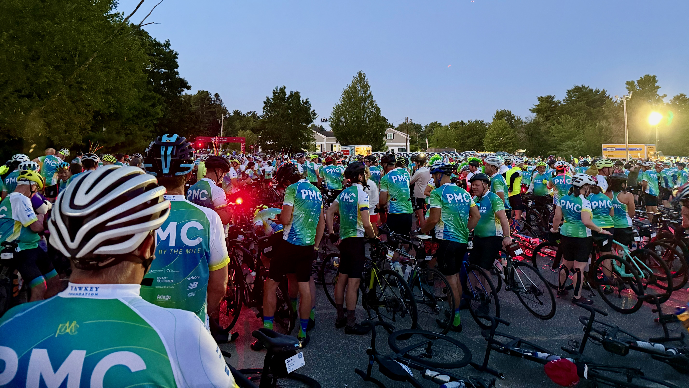
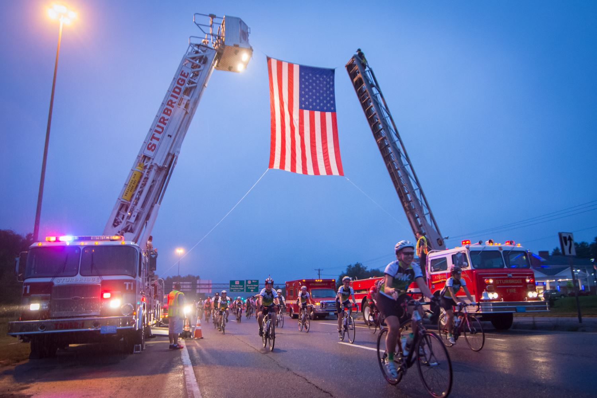
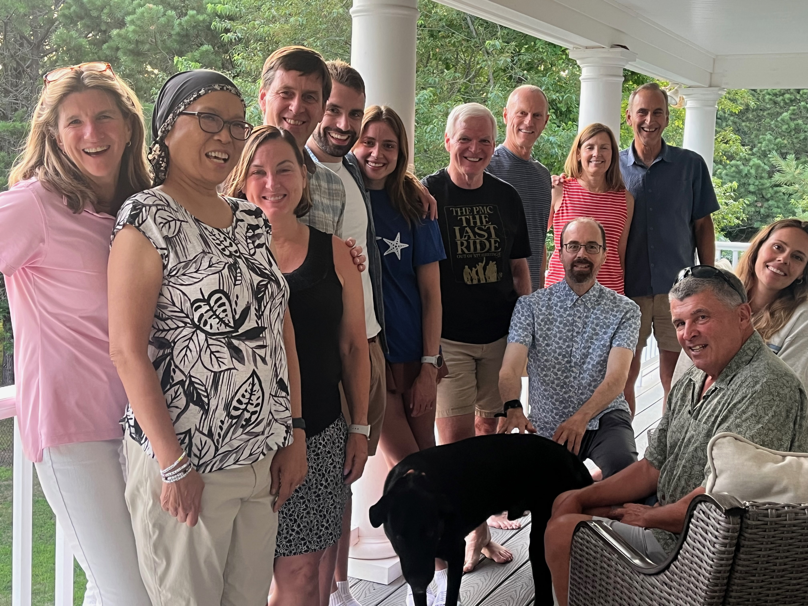

---
output:
  html_document: default
  pdf_document: default
---

# Day 1: Sturbridge to Bourne (109 miles)

We rise at 4:30 AM to be able to dress, schlep our gear to the trucks that will take them to our first day finish at Bourne, MA, then get breakfast at 5 AM. As in previous years, PMC recruits cheerleaders from the local high school to cheer us as we enter the breakfast area, which always makes me smile. Between the bus drivers ferrying riders from surrounding hotels, the people laying out breakfast and coffee, and the cheerleaders, I'm always so appreciative of the 6,000 volunteers that make our catatonic stumbling and ride so easy and seamless. We just wake up, eat, ride, eat, drink, ride, eat, drink, shower, and eat. They make it so much easier and so much more pleasant.

The Day 1 start at Sturbridge was the same as previous years: Team Crank crowded ourselves into the starting area, Billy Starr said his brief words of charge, then a volunteer sang the national anthem, and we were off, shuffling in our cycling shoes and cleats through the portal, across the timing strip, then mounting and beginning the journey.

As you pass through the portal, the narrow street is lined with people--families of all ages--who come and are already cheering for you, thanking you for riding. As always, this is recurrs all day, all weekend.

The PMC gets the entire eastbound lane of Route 20 (parallel to the Massachusetts Turnpike) to the PMC riders for the first 5 miles. About 1/2 mile from the start, two ladder fire trucks suspend an enormous American flag that we roll under. I always find it incredibly moving.

The hallmark of this year's PMC was the spectacular weather. We had two days of sun, low humidity and high temperatures in the high 70's to low 80's, and with a quartering tailwind in much of the ride. It was hands-down the best weather I've ever had on a PMC weekend. And all the PMC riders I spoke with that weekend--many of whom have been doing this for 15-25 years--said the same thing. This was in marked contrast to our experience 2 years ago, the last time Ellen rode it with me, when people--including one of my friends--were taken to the hospital due to heat exhaustion and dehydration.

Not so this year: we rolled out of Sturbridge with the temperatures in the mid-50's and sufficiently chilly that I was glad that I brought some thin arm warmers; a light cycling vest would have been even better.

The cool temperatures created fog on the ponds we paseed I found myself taking in more of the ponds and woodlands and scenery than I remember. Partly it was the beauty of the rising sun and the misty ponds and field, and partly it was desire to imprint these scenes to memory, as we won't pass this way again.

Day 1 from Sturbridge is long at 109 miles and has some short but taxing climbs. There are bystanders that try to make the effort more enjoyable. My favorite one is people at the top of one of the steeper pitches that hand out leis. I always try to get one and wear it through the day. I find the whimsy of it amusing, a marker of the crazy-quilt PMC experience.

There is an organic, flowing nature to a large-scale cycling event. At the start, we are a mass of riders, otherwise known as the "peloton". The combination of the variety of people's cycling abilities, the variety of terrain, and the quality of the road surface serve to eventually stretch out the original large group. There is an ebb and flow to the peloton. Sometimes the climbs cause coagulating of many riders, then the flats and downhills allow me to separate from others. Given sufficient distance, you come to a steady state, passing few, few passing you. Several times when I was riding with Ellen we were alone, riding at our own pace, not having to pay attention to other bikers. Those were lovely moments.

One thing that makes riding the PMC enjoyable is the that in many places along our route the PMC has hired local police to allow us to just roll through most intersections. You don't notice it at first, but added up over two days, not having to stop and start again, just rolling though, saves considerable energy and reduces the need for vigilance about cars.

My favorite part of Day 1 is when we turn onto Cherry Street in Wrentham, MA. Every year this 1/2 mile tree-line stretch is full of people who set out banners and there is a steel drum band and a separate group of bag pipers. The whole community seems to turn out. I always laugh and delight in the support we get from such communities.

Farther down the road the routes from Sturbridge to Bourne merge with the route from Wellesley to Bourne. It feels like the confluence of a tributary river that fills the streets.

## At the rest stops

Just after the joining of the routes we get to the main lunch stop at Dighton-Rehoboth High School. We arrived by about 10:30 AM. By then we have been riding for 70 miles and nearly 4.5 hours, so eating lunch is totally appropriate. The whole clock for the weekend is moved forward by about 2-3 hours. At lunch we are often able to reconnect with our team members and chill for 30-45 minutes. Generally, if you are doing a long endurance ride, when you stop for food and drinks, it's best to be as quick as possible, 5-10 minutes being ideal, lest your muscles start to tighten up and make restarting harder. With a group of people, that's always more challenging, but with a committed group of 4-6 people, it's manageable.

## Friends enroute

Just after the last rest stop in Wareham, MA, our great friends Jane and Garry Douglas were by the side of the road with a banner for us. It's particularly nice to have friends show up and encourage us.

## Day 1 results

## After Day 1: the kindness of family and friends

I took my friend John around the PMC encampment at Massachusetts Maritime Academy where the PMC ends after Day 1. We grabbed a coffee and some food, listened to a little music, and took in a little of the post-ride ambiance.

Our great friends Jane and Garry Douglas left a car so that John and I could drive ourselves and our bikes back to their lovely house in Wrentham, MA, about 6 miles away. This was a wonderful gathering, complete with luxurious showers, adult recovery beverages and a delicious barbecue dinner. We were joined by my partner, Karen, John's wife, Donna, Ellen's fiancé, Michael, another PMC rider and friend, Peter Worley, and our friends Susan and Roger Mann. Susan has been undergoing active chemotherapy for cancer for the last 18 months or so.

It was deeply meaningful to be able to spend time with all these dear friends and have Susan as a tangible reminder of why we ride.

Our great friends, Liney and Paul Bolick, provided overflow housing nearby in Marion for the extra-large contingent this year, for which we are truly grateful. With very comfortable beds, we were soon asleep, sleeping the sleep of the righteous--or at least physically tired.
