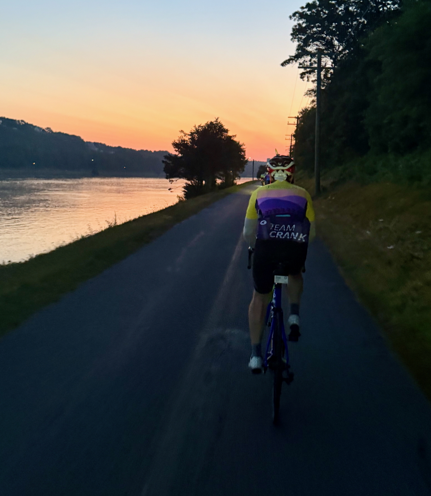
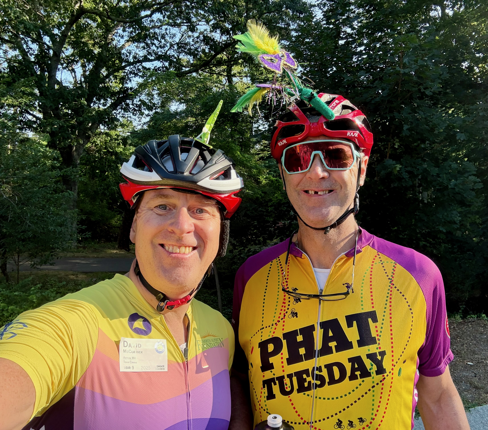
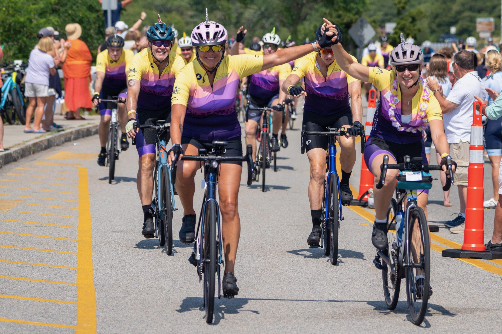
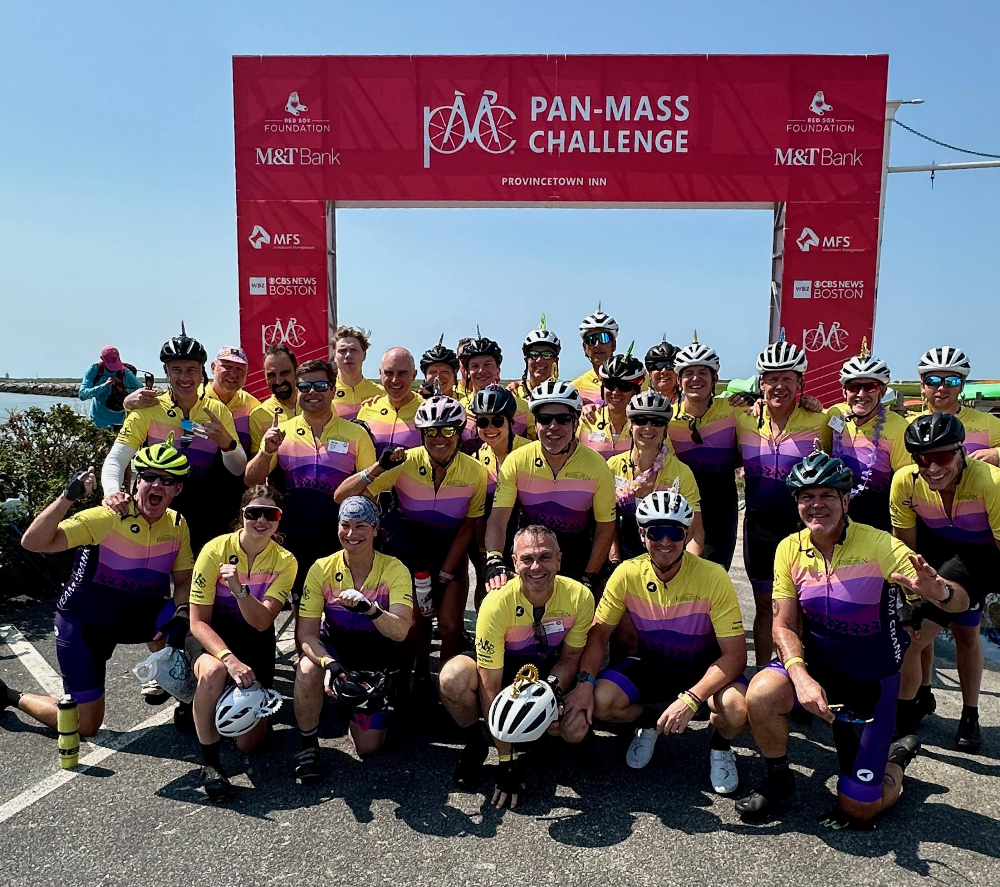
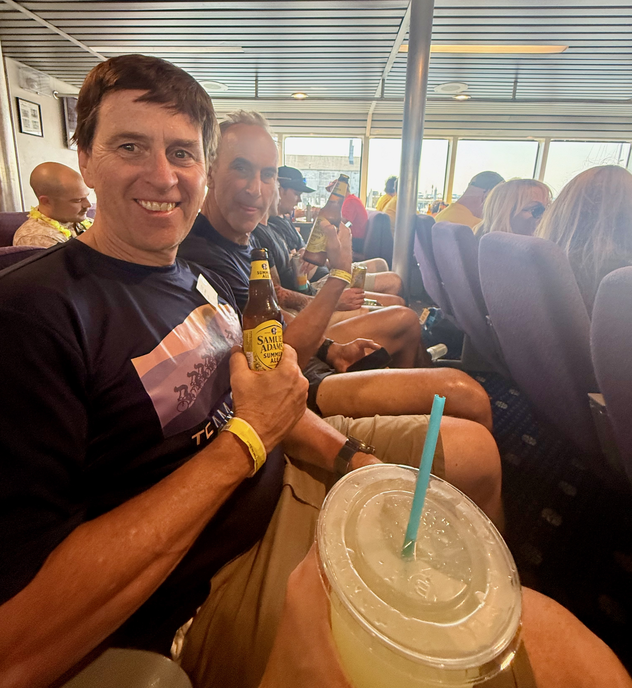
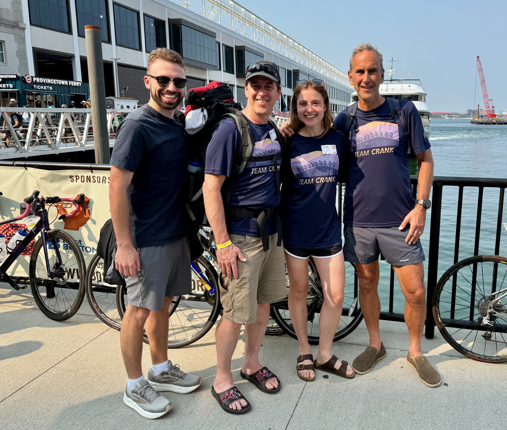

---
output:
  html_document: default
  pdf_document: default
---

# Day 2: Bourne to Provincetown (76 miles)

Day 2 is a very early start. We aimed to be back in Bourne and ready to roll by 4:45-5:00 AM. That means a 3:30 AM start to get groggily up, dress, get breakfast, and drive back to the start about 20 minutes away. But we manage with the help of our dedicated support crew.

The early start before dawn on the road necessitates the use of head- and tail lights. The PMC has arranged that we can cross over the Bourne Bridge onto Cape Cod with one of the lanes dedicated just to bike riders. This is a huge gift, because during normal hours, you would have to walk your bike over the bridge on a raised sidewalk, for the better part of half a mile, which would be no fun at all. In addition, by going very early, we miss the majority of the people trying to cross after 5 AM.

## The Cape Cod Canal

We loop around under the bridge and go on the Cape Cod Canal bike path. This is an amazing treat for several reasons. First, it's dead flat for 5 miles, which is the perfect way to get your legs to wake up after the demands of the previous day. Second, it's a bike path, so you don't have to worry about cars, which removes some of the need for full attention (which is harder at 5 AM before dawn). Third, it's a beautiful experience riding path and seeing serpentine trail of blinking red tail lights trailing out as far as you can see. Finally, we are riding into the sunrise by the time we reach the end of the line in Sandwich, MA, at the east end of the canal and bike path. And like the giant flags from the fire trucks in Sturbridge the day before, there is a fire boat that sits in the canal spouting water as a recognition of the PMC riders coming through.

## Down the spine of Western Cape Cod

We enter regular roads for a few miles out of Sandwich as we gently climb up parallel to the main highway that runs down the spine of Cape Cod (Route 6). We end up on the access road that parallels Route 6, which for you geology and geomorphology fans, is a terminal glacial moraine, the end point of the glaciers. Once we get up on the service road, the fun begins with a long stretch of rolling short descents and climbs. The climb to the access road serves to filter out a lot of riders. By the time you are up on the access road, there are relatively few riders with you, so you can let it rip. You can easily get up a good head of steam and get to 30-35 mph on the descents, which will get you up most of the next climb with minimal effort. When you get the rhythm going, it's great fun and the miles fly by.

We hit the first rest stop in Brewster at 22 miles by about 6:25 AM. We regrouped with most of the Team Crank crew. We tried to ride as a group from there out, with varying degrees of success.

One of the nice moments of Day 2 is stopping by the roadside near Dennis, MA, where one of our Team captains has a house. His family meet him at the intersection of our route and provide donuts and well wishes. Like last year, a guy who was treated at Dana-Farber and has been 10 years in remission was there with a sign to thank all the riders. Again, he is a tangible reminder of why we ride.

The stretch from Brewster to Orleans requires more concentration: we are on the main streets that pass through the towns on the bay side of Cape Cod, and by 7-8 AM there are some cars on the road. The locals know that the PMC will be coming through and generally steer clear of the PMC route, but there are some poor souls that have to drive on those roads. It can be nervous-making for both the drivers and the riders, as thousands of riders, sometimes in long lines one and two abreast slowly make their way up the roads, making it difficult for cars to pass or make turns. This is my least favorite part of the PMC weekend, but everyone seems to make it through safely. If you are overtaking other riders, you generally say "on your left" and try to pass as quickly as possible, and slot back in to the right. But sometimes you just have to decelerate, sit back for a minute or two, chill out, and just take it all in; it's not a race...for most people. My friend, John, for example, was absolutely crushing it all day, playing with the two strongest riders in Team Crank, Patrick and Bill. They made it to Provincetown at least 40 minutes faster than we did, and they had an absolute blast doing it.

We rode past the former site of Cape Cod Sea Camps where for so many years hundreds of campers and adults lined a long hedge (aka, "Da Hedge"), giving us encouraging shouts. Sadly, the camps were sold a few years ago. My friend, John, who rode with us this year went to the Sea Camps was a camper and counselor for many years when he was a kid. It was nostalgic for him. There are still people who come out at Da Hedge to wave us on, so the tradition is not entirely lost.

Eventually we get to the second rest stop at Nickerson State Park in Orleans near the elbow in Cape Cod. It's smaller in area, so it always feels like a mob scene. But you manage to see a lot of the bigger teams that come year after year. I managed to connect with my National Grid colleague, Fred, who is an absolute animal of a rider.

We try to make that stop as short as possible, because it's a bit of a crush getting out. As the weather was fabulous and everyone was feeling good, we pressed on. We were half way done and not even 9 AM.

## Eastern Cape Cod

When you go through Orleans and Eastham, the crowds and cars thin out, and I feel more relaxed. I tried to be a better father this year and stay with Ellen as much as I could. Depending on how many people were around and whether I was ahead, I wasn't always conscious of whether she was on my wheel. In these sections on the northern Cape, Ellen and I were able to ride together alone at several points, which is very relaxing, not having to watching for riders braking, or being able to see potential hazards much sooner. It feels more like being out on a small group ride when you are training for the PMC.

At Eastham we use the Cape Cod Rail Trail for about 4 miles. This is always such a relaxing part of the ride, where we don't have to worry about cars, and just have to be mindful of the runners and walkers who use the trail. It's always under the trees, so we are sheltered from wind and sun, though that was not a factor this year.

We exit the rail trail in Wellfleet and turn right toward the Marconi Wireless Radio Station historic site and the climb up onto Ocean View Drive that looks out over the Atlantic Ocean. It's one of my favorite places to ride and a highlight of the weekend. We ride past the locally famous Beachcomber Bar and Restaurant (aka, "The Coma"). We then dive into the woods with some short, sharp, steep descents, curves, and climbs as we wind our way back towards the final rest stop at a school in Wellfleet.

The mood at this stop is generally jubilant. Teams are regrouping. It's 10 AM and we are only 20 miles from the finish. It all seems to go so quickly on Day 2. No need for ice couches or large amounts of rehydration as in previous years. Everyone was feeling great.

The majority of Team Crank was able to reassemble in Wellfleet, and we set off on the final stretch. We do 2 miles on Rt. 6, then peel off into the quieter wooded side roads in Wellfleet, with their kettlehole ponds and oak trees, which is exceedingly pleasant. We wind our way back from the Atlantic side to the Cape Cod Bay side of Wellfleet and get to ride through some remarkably hilly short sections and the beautiful tidal marshes.

There is no avoiding some riding on the main road, Route 6 in this final stretch. The shoulders are very wide and the conditions are generally good with minimal debris on the road, but it's much less enjoyable with cars going by at 50+ miles per hour, even if they are shouting and honking encouragement. We have to use an 8 mile stretch of Route 6. In some years it can be a brutal combination of strong northerly headwind and hot, exposed roads with no shade. This year there was some headwind, but no heat. The key to getting through that section is trying to get a good paceline established: ride single file with riders of about your ability and have people take turns riding on the front for a few minutes. If you do it right, just maintain a steady pace, you can overcome the effects of the headwind, save enormous amounts of energy, and make the miles roll by quickly. We did a good job on that section in about 25 minutes.

We turned off Route 6 to head on the final 4.5 loop out Race Point Road through oak forest and out onto the dunes north of Provincetown. It's a lovely stretch, essentially free of cars, and everyone knows it's the home stretch. A complex set of emotions set in, knowing we are about to finish.

The entire Team Crank regrouped before the finish so that we could all cross the finish line together.

## Day 2 results

## Provincetown

As is the custom, just after finishing, we took our team photo under the PMC banner. It's a moment of collective joy. The weather was so spectacularly good, that everyone was feeling well, no one overheated, all with fatigue, but mostly a sense of satisfaction. The training, the fundraising, the effort all behind us.

The shower in the military shower tent always feels magnificent. Out of our rigid cycling shoes, strip off the sweaty clothing, let the warm water wash away the salt and grime. Utter bliss.

And then it's on to the food tent for unlimited servings of things like lobster bisque or New England clam chowder from Legal Seafood, wraps, hamburgers, salad...whatever you need, plus adult recovery beverages. And then you find your tribe and start to relive the weekend.

## Final PMC Kismet

The final installment of PMC Kismet happened when I ran into a dear friend, Alex Whiting, who I had no idea was riding. We compared our experiences and how great the weather was for all of us.

## The Fast Ferry Home

To get back to Boston, some people stay overnight in the area, or have loved-ones drive them back to the mainland. The majority take one of several ferries back to Boston. I mostly have opted for one of the fast ferries that take about 90 minutes. Leaving at 2pm, it means I can generally be home by 5pm. After the two days of rising before 4:30 AM, I know I will turn into a pumpkin by about 8pm.

Ellen, John, and I and several Team Crank members took the 2pm fast ferry back. The seats are comfortable and some immediately go to sleep for the duration of the trip. John and I reflected and reminisced about the the small moments, the feeling of being swept along in the river of riders, and the magnitude of the event.

There wasn't much wind, so the trip was very comfortable. It's a lovely way to come into Boston via the South Shore beach communities, through the Harbor Islands, past Logan Airport. There is always a fireboat in Boston that is spraying its water jets for the returning PMC ferries.

We came into the World Trade Center docks and slowly disembarked the boat with our luggage and retrieved our bikes. Unlike last year, there was no rain to drench us at the docks. Ellen's fiance, Michael, was kind enough to meet Ellen and me, while John's wife, Donna, took John off back to New Hampshire.

And so it was over. Two days gone in a seeming flash. But great satisfaction and enjoyment and connection.
