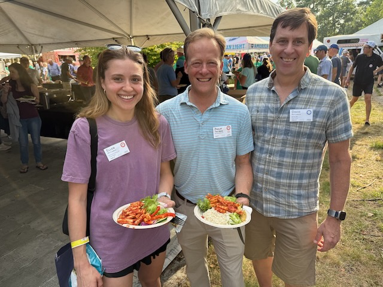

---
output:
  html_document: default
  pdf_document: default
---

# The Last Ride out of Sturbridge
For several decades, the main two-day PMC ride has started from Sturbridge, MA, and follows a well-trodden path to Bourne, MA, at the edge of Cap Cod. For a variety of reasons, the leadership of the PMC wanted to shift to a new starting location. After several years of planning, they intend to start from Worcester, MA, about 25 miles northeast of Sturbridge. So this year was the final year for a start from Sturbridge.

This year was my 5th time riding from Sturbridge, but Ellen had never ridden from there. I had hoped that she would be able to ride from Sturbridge to have the "traditional" full PMC experience, and fortunately, she was able to join. Also, my friend, John, could have the full experience.

This year, we enlisted Ellen's fiancé and John's wife to ferry us from home to Sturbridge. As I have described in the past, it's a bit of a mob scene in Sturbridge with all the riders being dropped off at the main hotel where everyone stores their bikes (aka, The Corral) overnight. Over the course of a few hours, thousands of people, their bikes, and luggage accumulate. I would estimate that 2500-3000 people leave from Sturbridge. As the afternoon went on, it seemed like significantly more people were arriving than I remember in previous years; I believe that many of us wanted to have the Sturbridge start for the final time.

The check-in process is efficient, where you pick up your PMC jersey that everyone wears on Day 1 along with the tags that you put on your bike that indicate your name, your town, and how many years you have ridden the PMC.

{width="50%"}

One fun tradition is that if someone is a first-time rider, the staff will ring a loud cow-bell to alert the assembled mass that someone is new to PMC. My friend, John, was treated to this bell-ringing welcome.

After we get our packets, we affix the tags to our bikes, and a tag to your shirt for when you are wandering around before and after the ride. Like with other mass-start events (think Boston- or New York Marathons), these include an RFID chip that allows the PMC to track when everyone crosses timing strips when they leave Sturbridge and enter and leave every rest stop along the route, then arrive in the final stops, like Bourne on Day 1 or Provincetown on Day 2.

Once we had put the tags on the bikes and unpacked in our hotel rooms, we go to the food area at the main hotel. Throughout the PMC weekend, there is abundant food and drink and you never pay for anything (having paid for it upfront with the registration fee paid). At Sturbridge there is a large tent with tables to eat and meet with friends and team members.

As I have described before, over the years you start to recognize some of the riders who participate year on year. It's easier on the road when people wear team jerseys (on Day 2) or familiar attachments to their helmets (like the green frog for Team Kermit, or the plastic martini glasses for the Spin & Tonics).

## First PMC Kismet

I have spoken before of what I call PMC Kismet. This takes 2 forms: 1. The Known Unknown: You know someone is signed up for the PMC and you hope to cross paths and eventually do. 2. The Unknown Unknown: Serendipitously, you cross paths with someone you know that you had no idea was riding PMC.

Ellen and I had the Unknown Unknown version: 5 minutes into the food area, I saw someone's name badge who had an uncommon last name that sounded like a relation of my wife, Ebit. I asked and it was Phil Trottman from Greenwich, CT, who was riding his first PMC.

We made the connection and I realized only now that Phil is what PMC calls "Living Proof", someone who is riding the PMC who has been diagnosed with a form of cancer and has been successfully treated. I have friends who are Living Proof riders. They are tangible evidence of the importance of the importance of and the need for the types of unflagging clinical research that the PMC funds. People like Phil make it real for me in the moment.

We communed with our friends and teammates, let go of the quotidian anxieties and concerns of the previous week, and settled into the unique environment of PMC.

On the Friday night before PMC at the Sturbridge site, there is highly organized and -produced psych-up event is held. Billy Starr--the founder of PMC 46 years ago--and his staff bring a combination of Dana-Farber leadership, cancer researchers, and testimonials of people who have been treated by Dana-Farber. It is always moving and drives home the essential mission of what we do by riding and fundraising. This year the hall was filled to overflowing, further underscoring how many people had come to start for the last time from Sturbridge.

Billy Starr emphasized how essential our efforts and your generosity are this year in particular when over 2,000 cancer clinical trials have been canceled due to cuts in National Institutes of Health grants. So this gave extra import to our efforts to raise money for this most worthy of causes.
